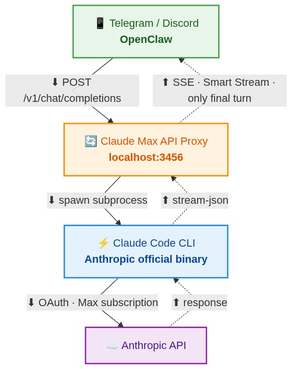

# Claude Max API Proxy

**English | [繁體中文](README.zh-TW.md)**

**Turn your $200/month Claude Max subscription into a Telegram/Discord AI assistant — powered by [OpenClaw](https://openclaw.dev).**

## Why This Exists

Using Claude's API with [OpenClaw](https://openclaw.dev) gets expensive fast — heavy usage can cost hundreds of dollars a month. Claude Max ($200/month) offers unlimited access, but Anthropic restricts it to the web UI and Claude Code CLI only — you can't use your subscription to power third-party tools like OpenClaw.

This proxy works around that limitation. It spawns the real Claude Code CLI as a subprocess and exposes an OpenAI-compatible HTTP API locally, so OpenClaw can use your Max subscription as the backend for Telegram and Discord bots.

## Why CLI Instead of Session Tokens?

Some people extract session tokens from the browser and use them directly. That works, but Anthropic can detect non-standard traffic patterns and ban the account — losing all conversation history and Projects.

This proxy takes a different approach: it spawns the real Claude Code CLI binary as a subprocess. Every request goes through Anthropic's official tool, so the traffic is indistinguishable from normal CLI usage.

> Based on [Benson Sun's architecture](https://x.com/BensonTWN/status/2022718855177736395) — open-sourced for the community.

## Key Features

### One Brain, One Context
Chat and code execution share the same Claude Code CLI session. The model can read a file, edit it, run tests, and report back — all within one continuous context. No separate agents, no context passing between services.

### Smart Streaming
The CLI produces intermediate output during tool calls — thinking steps, command output, internal reasoning. Smart Streaming buffers all of this and only forwards the final response to the client.

```
Without Smart Streaming:
  "Let me check that for you..."    ← leaked to client
  [tool call: Bash echo hello]      ← leaked to client
  "The result is: hello"            ← actual answer

With Smart Streaming:
  "The result is: hello"            ← only this reaches the client
```

### No Turn Limits
The CLI can execute as many tool calls as needed — Bash commands, file I/O, web search, browser automation. There's no artificial cap on the number of rounds, so complex tasks run to completion.

### Full OpenClaw Agent Parity
When used with [OpenClaw](https://openclaw.dev), this proxy supports all native agent features:
- **Web search** — Search and summarize web content
- **Browser automation** — Playwright-powered Chrome control with login state
- **Voice messages** — Whisper transcription in, TTS voice bubbles out
- **Scheduled tasks** — Cron-based task execution
- **Sub-agents** — Spawn child agents for parallel work
- **Media attachments** — Screenshots, files, audio as native Telegram/Discord media

### Session Persistence
Conversations maintain context across messages. The proxy maps each client conversation to a Claude CLI session — no need to resend full history every time.

### Timeout Protection
10-minute activity timeout catches stuck processes while letting long-running tasks complete normally. Timeout notifications are sent to Telegram so you know what happened.

## How It Works

<p align="center">
  
</p>

No third-party servers. Everything runs locally on your machine. The request leaves through Anthropic's own binary — identical to you typing in your terminal.

## Quick Start

### Prerequisites

1. **Claude Max subscription** ($200/month) — [Subscribe here](https://claude.ai/settings/billing)
2. **Claude Code CLI** installed and authenticated:
   ```bash
   npm install -g @anthropic-ai/claude-code
   claude auth login
   ```

### Install & Run

```bash
npm install -g claude-max-api-proxy
claude-max-api   # starts on http://localhost:3456
```

### Test

```bash
# Health check
curl http://localhost:3456/health

# Chat (streaming)
curl -N -X POST http://localhost:3456/v1/chat/completions \
  -H "Content-Type: application/json" \
  -d '{
    "model": "claude-sonnet-4",
    "messages": [{"role": "user", "content": "Hello!"}],
    "stream": true
  }'
```

### Auto-Start on macOS

Create `~/Library/LaunchAgents/com.claude-max-api.plist`:

```xml
<?xml version="1.0" encoding="UTF-8"?>
<!DOCTYPE plist PUBLIC "-//Apple//DTD PLIST 1.0//EN"
  "http://www.apple.com/DTDs/PropertyList-1.0.dtd">
<plist version="1.0">
  <dict>
    <key>Label</key>
    <string>com.claude-max-api</string>
    <key>RunAtLoad</key>
    <true/>
    <key>KeepAlive</key>
    <dict>
      <key>SuccessfulExit</key>
      <false/>
    </dict>
    <key>ProgramArguments</key>
    <array>
      <string>/opt/homebrew/bin/node</string>
      <string>/opt/homebrew/lib/node_modules/claude-max-api-proxy/dist/server/standalone.js</string>
    </array>
    <key>EnvironmentVariables</key>
    <dict>
      <key>HOME</key>
      <string>/Users/YOUR_USERNAME</string>
      <key>PATH</key>
      <string>/opt/homebrew/bin:/usr/local/bin:/usr/bin:/bin</string>
      <!-- Optional: for timeout notifications -->
      <key>TELEGRAM_NOTIFY_ID</key>
      <string>YOUR_TELEGRAM_USER_ID</string>
    </dict>
    <key>StandardOutPath</key>
    <string>/tmp/claude-max-api.log</string>
    <key>StandardErrorPath</key>
    <string>/tmp/claude-max-api.err.log</string>
  </dict>
</plist>
```

Then load it:
```bash
launchctl load ~/Library/LaunchAgents/com.claude-max-api.plist
```

## Configuration

### Environment Variables

| Variable | Required | Description |
|----------|----------|-------------|
| `TELEGRAM_NOTIFY_ID` | No | Telegram user ID for timeout notifications |
| `CLAUDE_CODE_OAUTH_TOKEN` | No | Explicit OAuth token (otherwise uses CLI's keychain) |

### Available Models

| Model ID | Description |
|----------|-------------|
| `claude-opus-4` | Claude Opus 4 (most capable) |
| `claude-sonnet-4` | Claude Sonnet 4 (balanced) |
| `claude-haiku-4` | Claude Haiku 4 (fastest) |

Full model family support with version pinning (e.g. `claude-opus-4-5-20251101`).

## OpenClaw Integration

Add as a model provider in your `openclaw.json`:
```json
{
  "models": {
    "providers": {
      "maxproxy": {
        "baseUrl": "http://127.0.0.1:3456/v1",
        "apiKey": "not-needed",
        "api": "openai-completions"
      }
    }
  }
}
```

See the [OpenClaw documentation](https://openclaw.dev) for full setup instructions.

## API Endpoints

| Endpoint | Method | Description |
|----------|--------|-------------|
| `/health` | GET | Health check |
| `/v1/models` | GET | List available models |
| `/v1/chat/completions` | POST | Chat completions (streaming & non-streaming) |

## Architecture

```
dist/
├── adapter/
│   ├── openai-to-cli.js   # OpenAI request → CLI prompt + system prompt
│   └── cli-to-openai.js   # CLI result → OpenAI response format
├── subprocess/
│   └── manager.js          # CLI subprocess lifecycle & activity timeout
├── session/
│   └── manager.js          # Conversation → CLI session mapping
├── server/
│   ├── routes.js            # Smart streaming, SSE, progress notifications
│   ├── index.js             # Express server setup
│   └── standalone.js        # Entry point
└── types/
    └── claude-cli.js        # CLI stream-json event type guards
```

## Security

- **No shell injection** — Uses Node.js `spawn()`, not `exec()`
- **No stored credentials** — Authentication handled by Claude CLI's OS keychain
- **No hardcoded secrets** — All sensitive config via environment variables
- **Local only by default** — Binds to `127.0.0.1`, not exposed to network

## Tips

- **Don't run heartbeat/cron jobs through Opus** — Fixed-interval requests look like bot traffic. Use lightweight models (Gemini Flash, Haiku) for scheduled tasks.
- **Stay within your weekly token limits** — The proxy doesn't circumvent any usage caps. If you rarely hit your Claude Code weekly limit, you have plenty of headroom.

## License

MIT

## Credits

- Original concept and architecture by [Benson Sun](https://x.com/BensonTWN/status/2022718855177736395) — this project is an open-source implementation of his design, with some modifications
- Initial codebase forked from [atalovesyou/claude-max-api-proxy](https://github.com/atalovesyou/claude-max-api-proxy)
- Smart streaming, session management, and OpenClaw integration built with [Claude Code](https://github.com/anthropics/claude-code)
