# Claude Max API Proxy

**[English](README.md) | 繁體中文**

**把 Opus 4.6 變成你的日常 AI 助手 — 透過 Telegram 和 Discord — 用你每月 $200 的 Claude Max 訂閱搭配 [OpenClaw](https://openclaw.dev) 驅動。**

## 為什麼做這個

Opus 4.6 是目前最好的對話 AI 模型。它有個性、推理能力超強、講話直接像個靠譜的工程師直男，但關鍵時刻又會給你足夠的情緒價值。問題是？透過 Anthropic API 按量計費，重度使用一小時就能燒掉 $10+。Claude Max 每月 $200 吃到飽 — 但只能透過網頁 UI 和 Claude Code CLI 使用。

這個 Proxy 打通了這道牆。它把 Claude Code CLI 包裝成本地 HTTP 伺服器，對外說 OpenAI 的語言，專為搭配 [OpenClaw](https://openclaw.dev) 作為 Telegram/Discord 機器人前端而設計。

## 為什麼不直接用 Session Token？

很多人現在是拿 Claude Max 的 Session Token 去接第三方服務。能用，但風險很高：

| 方案 | 做法 | 風險 |
|------|------|------|
| **Session Token 抽取** | 從瀏覽器偷 cookie/token | Anthropic 能偵測非 CLI 的流量特徵（user-agent、request timing、token consumption）。帳號被 Ban = 所有對話紀錄、Projects、花幾週調教出來的思維慣性全部歸零。 |
| **這個 Proxy（Claude Code CLI）** | 每個 request 都經過 Anthropic 自己的 Binary | 跟你坐在 Terminal 前面打字完全一樣。這*就是* Claude Code — 只是輸入從鍵盤搬到了手機。 |

核心洞察：Claude Code CLI 是 Anthropic 的官方產品。從它發出的流量就是正規的開發行為。這個 Proxy 不偽造任何東西 — 它真的就是 spawn 了一個 CLI 子程序。

> 基於 [Benson Sun 的架構設計](https://x.com/BensonTWN/status/2022718855177736395)，開源出來給社群使用。

## 核心功能

### 一個大腦、一份 Context
傳統架構用一個模型聊天、另一個 Coding Agent 寫程式。兩個腦子來回傳話，每一層都有延遲跟 Context 丟失。這個 Proxy 讓所有事情都跑在同一個 Claude Code CLI session 裡 — 聊天、讀檔案、改代碼、跑測試、Git Commit — 全部共用同一份 Context。讀完需求下一秒就能改檔案，改完直接回報。沒有交接。

### 智慧串流 (Smart Streaming)
一般 proxy 會把所有中間輸出都丟給客戶端 — 工具呼叫的思考過程、內部推理、除錯文字。智慧串流會暫存每一輪的輸出，只串流最終回覆。你的使用者只看到乾淨的答案。

```
沒有智慧串流：
  "讓我查一下..."                    ← 洩漏給客戶端
  [工具呼叫: Bash echo hello]       ← 洩漏給客戶端
  "結果是: hello"                   ← 實際答案

有智慧串流：
  "結果是: hello"                   ← 只有這個到達客戶端
```

### Agent 工具呼叫（無輪數限制）
CLI 可以完整使用工具 — Bash、檔案讀寫、網頁搜尋、瀏覽器自動化。不像一般 proxy 把工具呼叫限制在固定次數，這個 proxy 完全移除了輪數限制。複雜的多步驟任務可以完整執行到結束。

### 100% 追平 OpenClaw 原生 Agent
搭配 [OpenClaw](https://openclaw.dev) 使用時，這個 Proxy 達到與原生 Agent 完全一致的功能：
- **搜尋網頁** — 搜尋並摘要網頁內容
- **瀏覽器自動化** — Playwright 驅動的 Chrome 控制，支援登入態
- **語音訊息** — Whisper 轉錄輸入，TTS 語音泡泡輸出
- **排程任務** — Cron 定時任務執行
- **子代理** — 產生子 Agent 平行處理工作
- **媒體附件** — 截圖、檔案、音訊以原生 Telegram/Discord 媒體發送

### 對話持久化
對話能跨訊息維持上下文。Proxy 把每個客戶端對話對應到一個 Claude CLI session — 不需要每次都重送完整歷史。

### 超時保護
10 分鐘的活動超時機制捕捉卡住的程序，同時讓長時間執行的任務正常完成。超時觸發時會透過 Telegram 通知你。

## 運作原理

<p align="center">
  
</p>

沒有任何第三方伺服器。所有東西都在你的機器上跑。Request 從 Anthropic 自己的 Binary 出去 — 跟你坐在 Terminal 前面打字完全一樣。

## 快速開始

### 前置需求

1. **Claude Max 訂閱**（$200/月）— [在此訂閱](https://claude.ai/settings/billing)
2. **Claude Code CLI** 已安裝且已認證：
   ```bash
   npm install -g @anthropic-ai/claude-code
   claude auth login
   ```

### 安裝與執行

```bash
npm install -g claude-max-api-proxy
claude-max-api   # 啟動於 http://localhost:3456
```

### 測試

```bash
# 健康檢查
curl http://localhost:3456/health

# 聊天（串流）
curl -N -X POST http://localhost:3456/v1/chat/completions \
  -H "Content-Type: application/json" \
  -d '{
    "model": "claude-sonnet-4",
    "messages": [{"role": "user", "content": "你好！"}],
    "stream": true
  }'
```

### macOS 開機自動啟動

建立 `~/Library/LaunchAgents/com.claude-max-api.plist`：

```xml
<?xml version="1.0" encoding="UTF-8"?>
<!DOCTYPE plist PUBLIC "-//Apple//DTD PLIST 1.0//EN"
  "http://www.apple.com/DTDs/PropertyList-1.0.dtd">
<plist version="1.0">
  <dict>
    <key>Label</key>
    <string>com.claude-max-api</string>
    <key>RunAtLoad</key>
    <true/>
    <key>KeepAlive</key>
    <dict>
      <key>SuccessfulExit</key>
      <false/>
    </dict>
    <key>ProgramArguments</key>
    <array>
      <string>/opt/homebrew/bin/node</string>
      <string>/opt/homebrew/lib/node_modules/claude-max-api-proxy/dist/server/standalone.js</string>
    </array>
    <key>EnvironmentVariables</key>
    <dict>
      <key>HOME</key>
      <string>/Users/YOUR_USERNAME</string>
      <key>PATH</key>
      <string>/opt/homebrew/bin:/usr/local/bin:/usr/bin:/bin</string>
      <!-- 選用：超時通知 -->
      <key>TELEGRAM_NOTIFY_ID</key>
      <string>YOUR_TELEGRAM_USER_ID</string>
    </dict>
    <key>StandardOutPath</key>
    <string>/tmp/claude-max-api.log</string>
    <key>StandardErrorPath</key>
    <string>/tmp/claude-max-api.err.log</string>
  </dict>
</plist>
```

然後載入：
```bash
launchctl load ~/Library/LaunchAgents/com.claude-max-api.plist
```

## 設定

### 環境變數

| 變數 | 必填 | 說明 |
|------|------|------|
| `TELEGRAM_NOTIFY_ID` | 否 | 超時通知的 Telegram 使用者 ID |
| `CLAUDE_CODE_OAUTH_TOKEN` | 否 | 明確指定 OAuth token（否則使用 CLI 的 Keychain）|

### 可用模型

| Model ID | 說明 |
|----------|------|
| `claude-opus-4` | Claude Opus 4（最強）|
| `claude-sonnet-4` | Claude Sonnet 4（均衡）|
| `claude-haiku-4` | Claude Haiku 4（最快）|

支援完整模型家族與版本鎖定（例如 `claude-opus-4-5-20251101`）。

## OpenClaw 整合

在你的 `openclaw.json` 中新增為模型提供者：
```json
{
  "models": {
    "providers": {
      "maxproxy": {
        "baseUrl": "http://127.0.0.1:3456/v1",
        "apiKey": "not-needed",
        "api": "openai-completions"
      }
    }
  }
}
```

完整設定請參考 [OpenClaw 文件](https://openclaw.dev)。

## API 端點

| 端點 | 方法 | 說明 |
|------|------|------|
| `/health` | GET | 健康檢查 |
| `/v1/models` | GET | 列出可用模型 |
| `/v1/chat/completions` | POST | 聊天補全（串流與非串流）|

## 架構

```
dist/
├── adapter/
│   ├── openai-to-cli.js   # OpenAI 請求 → CLI prompt + 系統提示詞
│   └── cli-to-openai.js   # CLI 結果 → OpenAI 回應格式
├── subprocess/
│   └── manager.js          # CLI 子程序生命週期與活動超時
├── session/
│   └── manager.js          # 對話 → CLI session 對應
├── server/
│   ├── routes.js            # 智慧串流、SSE、進度通知
│   ├── index.js             # Express 伺服器設定
│   └── standalone.js        # 進入點
└── types/
    └── claude-cli.js        # CLI stream-json 事件型別守衛
```

## 安全性

- **無 Shell 注入** — 使用 Node.js `spawn()`，非 `exec()`
- **無儲存憑證** — 認證由 Claude CLI 的 OS Keychain 處理
- **無寫死的秘密** — 所有敏感設定透過環境變數
- **僅限本機** — 預設綁定 `127.0.0.1`，不對外暴露

## 使用建議

- **不要拿 Opus 跑 heartbeat/cron** — 固定間隔的 request 可能被視為機器流量。排程任務交給輕量模型（Gemini Flash、Haiku）就好，殺雞不用牛刀。
- **注意 weekly token 上限** — 這個 Proxy 不會繞過任何用量限制。如果你的 Claude Code 很少用到 weekly 上限，就有很大的空間可以用。

## 授權條款

MIT

## 致謝

- 原始概念與架構設計來自 [Benson Sun](https://x.com/BensonTWN/status/2022718855177736395) — 本專案是他方案的開源實作，有部分改動
- 初始代碼 fork 自 [atalovesyou/claude-max-api-proxy](https://github.com/atalovesyou/claude-max-api-proxy)
- 智慧串流、Session 管理、OpenClaw 整合由 [Claude Code](https://github.com/anthropics/claude-code) 實作
